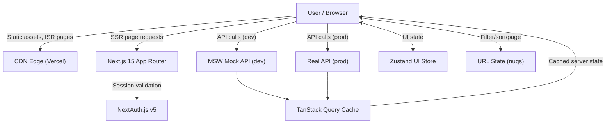

# Frontend Architecture Brief — NeurolinkX

> Stack: Next.js 15, React 19, TypeScript 5, TailwindCSS 4  
> Target: Healthcare SaaS platform · 2M MAU

---

## 1. Rendering Strategy

One of the first things I had to figure out was how each page should load. Not every page needs the same approach some need to be fast, some need to be secure, some need fresh data. Here's what I decided and why.

**Login / Signup / Forgot Password → SSR**  
These pages are server-rendered on every request. The main reason is security I want the server to check your session before anything reaches the browser. If you're already logged in and try to visit `/login`, the server catches that and redirects you to the dashboard immediately. No flash of the wrong page.

**Dashboard Home → CSR + TanStack Query**  
The dashboard shows your personal KPI data total shipments, revenue, on-time percentage. This data is different for every user and changes constantly, so pre-building it makes no sense. The page shell loads instantly and TanStack Query fetches the data in the background. While it's loading, skeleton cards show so the page doesn't feel broken. Stale time is set to 60 seconds so we're not hammering the API on every click.

**Shipments List → CSR with URL state**  
This is the most interactive page filters, sorting, pagination, search. I keep all of that in the URL using `nuqs` so if you filter by "delayed" and refresh the page, the filter is still there. You can also share the URL with a colleague and they'll see the same view. The data is fetched client-side because it's authenticated and paginated by the server.

**Shipment Detail → ISR (revalidate: 60s)**  
Individual shipment pages are a good fit for ISR. The page is pre-built and cached at the CDN so it loads instantly. Every 60 seconds Next.js rebuilds it in the background with fresh data. The status timeline and live tracking are fetched client-side on top of that for real-time accuracy. The big win here is TTFB the page comes from cache, not the origin server.

**Settings → CSR**  
Personal account settings are user-specific and never crawled by search engines. Full client-side rendering with React Hook Form. Nothing fancy needed here.

**Public/Marketing pages → SSG**  
Pre-built at deploy time, served from the CDN edge. Zero server involvement. Best possible performance.

---

## 2. Component Architecture

For a 50-engineer team, you need structure or things fall apart fast. My approach is a monorepo using Turborepo with clear package boundaries:

```
apps/
  web/              # The main Next.js app
packages/
  ui/               # Shared component library (Button, Modal, DataTable etc.)
  config/           # Shared ESLint, TypeScript, Tailwind configs
  utils/            # Shared helper functions
  types/            # Shared TypeScript types
```

**Why feature-based over layer-based?**

Layer-based structure looks like this:

```
components/
hooks/
utils/
services/
```

This seems clean at first but breaks down with a large team. If I need to change how shipments work, I'm touching files across 4 different folders. It's hard to know what belongs together.

Feature-based looks like this:

```
features/
  shipments/
    components/
    hooks/
    api/
  auth/
    components/
    hooks/
  notifications/
```

Everything related to shipments lives in one place. A new engineer can open `features/shipments/` and understand the entire feature without jumping around. This is how Linear and Vercel structure their codebases.

**Component boundaries I follow:**

- `packages/ui` — only presentational components, zero API calls, zero business logic
- `features/*/components` — composed from `packages/ui`, knows about domain types
- `features/*/hooks` — all data fetching lives here, nothing else
- `app/` — routing and layout only, as thin as possible

---

## 3. State Management at Scale

I used Zustand for UI state and TanStack Query for server state. Here's my thinking on why and where each breaks down.

**What Zustand is good for:**

- Is the sidebar open or closed?
- What theme is the user on?
- Is the notification drawer open?

These are small, UI-only values that don't come from the server. Zustand is perfect here — simple, fast, no boilerplate.

**Where Zustand breaks down:**  
The mistake I've seen (and almost made) is putting API data into Zustand too. Once you do that, your store becomes a God object — one giant blob of state that everything depends on. At 100+ components, any update to the store causes a huge re-render chain. It becomes impossible to trace where data comes from and tests start bleeding into each other.

**My solution for cross-feature state:**

| Type of state                         | Tool              |
| ------------------------------------- | ----------------- |
| Server data (shipments, users, stats) | TanStack Query    |
| URL state (filters, sort, page)       | nuqs              |
| Form state                            | React Hook Form   |
| UI state (sidebar, theme, drawers)    | Zustand           |
| Atomic shared state                   | Jotai (if needed) |

The key insight is: most state management problems are actually server state problems. Once TanStack Query owns all API data with proper cache keys and stale times, Zustand becomes tiny and manageable.

---

## 4. Performance at 2M MAU

**CDN strategy:**  
All static assets (JS bundles, CSS, images) are served from Vercel's Edge Network. Users get files from the server closest to them geographically. Cache headers per asset type:

- Static assets: `public, max-age=31536000, immutable` — cached forever, content-hashed filenames handle invalidation
- ISR pages: `s-maxage=60, stale-while-revalidate=3600` — cached at edge, rebuilt in background
- API responses: `private, no-cache` — authenticated data, never cached publicly

**Image optimisation:**  
`next/image` handles everything — automatic WebP/AVIF conversion, lazy loading, correct sizing per device. User-uploaded images (avatars) go through Cloudinary first to resize and compress before being stored.

**Handling a 10x traffic spike:**  
Vercel auto-scales horizontally within seconds so compute isn't the bottleneck. The real protection is caching — most requests for static and ISR pages never reach the origin server at all. For expensive operations like CSV exports or bulk status updates, those are offloaded to background jobs (Vercel Cron or BullMQ) so they don't block the main request thread. API rate limiting via Upstash Redis prevents any single client from hammering the server.

**Bundle size:**  
Heavy libraries are dynamically imported so they don't bloat the initial bundle:

- `recharts` — loaded only on the dashboard page
- `mapbox-gl` — loaded only on shipment detail
- `cmdk` — loaded only when command palette is triggered

Initial JS target: under 200KB, enforced by `@next/bundle-analyzer` running in CI.

---

## 5. Security Considerations

**XSS prevention:**  
React escapes all JSX values by default so user input can't become executable code. I have an ESLint rule banning `dangerouslySetInnerHTML`. Any user-generated content that absolutely must render as HTML goes through `DOMPurify` first.

**JWT storage:**  
JWTs live in httpOnly cookies — JavaScript literally cannot read them. This means even if an attacker manages to inject a malicious script into the page, it cannot steal the auth token. This is the right way. Storing JWTs in localStorage is a common mistake that makes XSS attacks catastrophic.

**CSRF protection:**  
NextAuth.js v5 uses the double-submit cookie pattern. Every state-changing request needs a CSRF token that matches the value in the cookie. A request forged from another website won't have this token so it gets rejected. Cookies are also set with `SameSite=Lax` which blocks most cross-origin requests automatically.

**Content Security Policy:**  
Set in `next.config.ts` via the `headers()` function. Tells the browser to only execute scripts from our own domain. Even if someone injects a `<script>` tag into the page, the browser refuses to run it.

**Secure cookie config:**

```
HttpOnly; Secure; SameSite=Lax; Path=/; Max-Age=86400
```

---

## 6. Trade-off Analysis

**Decision 1: MSW over JSON Server for the mock API**

I chose MSW because it intercepts requests at the network level inside the browser using a Service Worker. This means the mock behaves exactly like a real API — same Axios calls, same error handling, same loading states. Nothing in the app knows it's talking to a mock.

The alternative was JSON Server which is simpler to set up but runs as a separate Node process. You end up managing two terminals and the mock URL is different from your real API URL, which means code changes when you switch to production.

The trade-off with MSW is a slightly more complex initial setup and the service worker file in `/public`. At 10x scale, I'd just swap the MSW handlers for real API endpoints — zero changes to the application code.

**Decision 2: Tailwind CSS over CSS Modules**

I chose Tailwind with CSS custom property tokens because styles live right next to the component, there's no context switching between files, and the token system enforces the design system — you literally cannot use a hardcoded colour because it's an ESLint error.

The trade-off is that classNames can get very long (sometimes 200+ characters on complex components), which hurts readability. At 10x scale with a bigger team, I'd introduce CVA (Class Variance Authority) for variant management. It sits on top of Tailwind but gives you a clean API for defining component variants — the generated classNames stay the same, you just write them differently.

---

## Architecture Diagram



_Author: Anushka Prasad - NeurolinkX Frontend Developer Assignment_
